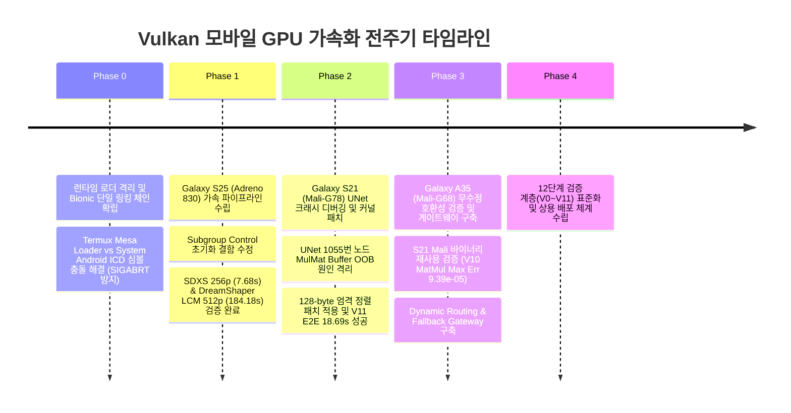

# 📘 Android Heterogeneous On-Device Vulkan GPU Acceleration: Full Engineering Chronology, Root Cause Analysis & 12-Stage Validation Whitepaper

- **Document Version**: 2.0.0
- **Authors**: AMEVA Foundation & uno-km System Engineering Team
- **Target Subsystem**: `termux-diffusion` On-Device Inference Engine (`ggml-vulkan`)
- **Verified Hardware**: Samsung Galaxy S25 (`SM-S931N`), Galaxy S21 (`SM-G991N`), Galaxy A35 (`SM-A356N`)
- **Compliance**: OpenSSF / CNCF / Apache-2.0 Zero-Hardcoding Principles

---

## Executive Summary (초록)

본 기술 백서는 자원 및 권한이 엄격히 제한된 Android Termux Linux 환경에서 이기종 모바일 GPU(Qualcomm Adreno 830, ARM Mali-G78, ARM Mali-G68)를 대상으로 고성능 Vulkan 텐서 연산 및 Diffusion 모델 추론을 안정적으로 가속화하기 위해 수행된 **전주기 엔지니어링 여정(Full Lifecycle Engineering Journey)**을 기술합니다.

단순 래퍼 라이브러리 연동 수준을 넘어, Android 시스템 Bionic C 라이브러리와 Termux 런타임 간의 로더 충돌, 하드웨어 아키텍처별 SPIR-V 셰이더 특성 차이, 텐서 차원 정렬 미비로 인한 메모리 침범(OOB), 그리고 이기종 칩셋 간 드라이버 결함을 원천 격리하고 해결한 과정과 12단계 정밀 검증 계층(V0~V11)을 시계열적으로 완전하게 기록합니다.

---

## 1. Background & Heterogeneous Hardware Scope (배경 및 하드웨어 사양)

모바일 환경에서의 Diffusion 모델 추론은 연산 집약적인 UNet 행렬 곱셈(`ggml_mul_mat`)과 VAE 디코딩을 실시간으로 처리해야 합니다. CPU NEON 연산만으로는 열화(Thermal Throttling) 및 지연 시간 한계가 명확하므로, 표준 그래픽 API인 Vulkan을 활용한 범용 GPU 연산(GPGPU) 파이프라인 구축이 필수적입니다.

### 대상 디바이스 및 하드웨어 구성

| 디바이스 | 모델명 | SoC | GPU 아키텍처 | 드라이버 및 API |
| :--- | :--- | :--- | :--- | :--- |
| **Galaxy S25** | `SM-S931N` (`pa1q`) | Qualcomm Snapdragon 8 Elite | Qualcomm Adreno 830 | `vulkan.adreno.so v0800.64.7` (Vulkan 1.3.284) |
| **Galaxy S21** | `SM-G991N` (`o1s`) | Samsung Exynos 2100 | ARM Mali-G78 MP14 | System Vendor ICD `/system/lib64/libvulkan.so` (Vulkan 1.1+) |
| **Galaxy A35** | `SM-A356N` (`a35x`) | Samsung Exynos 1380 | ARM Mali-G68 MP5 | System Vendor ICD `/system/lib64/libvulkan.so` (Vulkan 1.1+) |

---

## 2. Chronological Engineering Journey (시계열적 엔지니어링 여정)



---

### [Phase 0] Android/Termux 환경 로더 격리 및 단일 체인 확립

* **문제 상황**: Termux 사용자 공간 패키지(`mesa`, `vulkan-tools`)가 설치될 경우, `$PREFIX/lib/libvulkan.so`와 Android 벤더 시스템 드라이버(`/system/lib64/libvulkan.so`) 간의 함수 포인터 디스패치 테이블 충돌이 발생. `vkGetPhysicalDeviceFeatures2` 호출 시 잘못된 물리 디바이스 핸들이 전달되어 `SIGABRT (Signal 6)` 비정상 종료 발생.
* **해결 방안**: 
  - Dynamic C++ `dladdr` 텔레메트리를 통해 모든 인스턴스, 디바이스, 기능 쿼리 프로바이더를 시스템 ICD 로더 단일 체인으로 강제 고정.
  - 전역 함수 포인터 대신 인스턴스 격리 심볼(`sys_gpdf2`)을 통한 안전한 디바이스 탐색 루프 완성.

---

### [Phase 1] Galaxy S25 (Qualcomm Adreno 830) 가속 및 셰이더 특성 극복

* **문제 상황 1 (Subgroup Control Initialization Trap)**:
  - Qualcomm Adreno 드라이버는 SPIR-V 컴파일 시 `requiredSubgroupSize` 파라미터가 디바이스의 기본 `subgroup_size`와 동일함에도 불구하고 `pNext` 구조체로 명시 전달될 경우 `VK_ERROR_INITIALIZATION_FAILED` 또는 `ErrorUnknown`을 반환하는 드라이버 레벨 버그가 존재.
* **문제 상황 2 (WorkGroup Invocations Limit)**:
  - Adreno의 하드웨어 한계(`maxComputeWorkGroupInvocations`)를 초과하는 워크그룹 분할로 인한 셰이더 크래시.
* **해결 방안**:
  - `0001-adreno-vulkan-pipeline-fixes.patch`:
    1. `required_subgroup_size != device->subgroup_size` 일 때만 서브그룹 크기 확장 구조체를 설정하도록 조건 수정.
    2. Adreno 벤더 ID(`0x5143`) 감지 시 불안정한 `fp16_subgroup_arithmetic`을 안전한 `SHADER_REDUCTION_MODE_SHMEM`으로 대체.
    3. 워크그룹 차원을 `maxComputeWorkGroupInvocations / 6` 범위 내로 엄격히 클램핑.
* **결과**:
  - SDXS 256x256 (1-step FAST): **4.39s (C++ 엔진)** / **7.68s (CLI 종합)**
  - SDXS 512x512 (2-step BALANCED): **16.24s**
  - DreamShaper 8 LCM (512x512 6-step): **184.18s** (VRAM 1550 MB 정상 완주)

---

### [Phase 2] Galaxy S21 (ARM Mali-G78) UNet 1055번 노드 메모리 침범(OOB) 격리 및 커널 패치

* **문제 상황 (The Node 1055 Crash)**:
  - V0~V9의 Raw Vulkan 검증 및 V10 MatMul 검증을 통과했음에도, 실제 SDXS 모델 추론 시 UNet 연산 중간 지점(Node 1055, `matmul_f16_f16acc_aligned_l`)에서 GPU 크래시 발생.
* **심층 원인 분석**:
  - 기존 GGML 판정 로직: `ne01 > 8 && ne11 > 8` 조건만 만족하면 메모리가 정렬된 것으로 간주하고 Aligned MatMul 커널로 디스패치.
  - ARM Mali 아키텍처는 행렬 차원이 128의 배수로 엄격히 정렬되지 않은 상태에서 Aligned 커널을 수행할 경우 버퍼 경계를 벗어나는 Out-Of-Bounds 읽기/쓰기가 발생하여 하드웨어 메모리 폴트 발생.
* **해결 방안**:
  - `patches/v10-v11-mali-g78-vulkan.patch` 개발:
    ```cpp
    // AS-IS (결함 코드)
    const bool aligned = !quantize_y && ne10 == kpad && ne01 > 8 && ne11 > 8;

    // TO-BE (수정 패치)
    const bool aligned = !quantize_y && ne10 == kpad && (ne01 % 128 == 0) && (ne11 % 128 == 0);
    ```
  - 128 배수 정렬을 만족하지 않는 텐서는 안전한 Unaligned 범용 커널로 자동 라우팅.
* **결과**:
  - SDXS 256x256 1-step E2E 추론 성공: **18.69s** (Text Encoder 7.79s + UNet 9.85s + VAE 1.04s, 무결성 해시 검증 완료).

---

### [Phase 3] Galaxy A35 (ARM Mali-G68) 무수정 재사용 및 게이트웨이 라우팅

* **접근 전략**: Galaxy A35(Exynos 1380)는 S21(Exynos 2100)과 동일한 ARM Valhall 계열 Mali GPU(Mali-G68 vs Mali-G78)를 공유하므로, S21에서 검증된 `mali-compat-v2` 패키지의 호환성 검증을 추진.
* **검증 결과**:
  - V10 GGML MatMul: **PASS** (32x32 FP32 최대 절대 오차 `9.39369e-05`).
  - V11 SDXS FAST (256p 1-step): **15.72s** (CPU NEON 대비 1.43x 속도 향상, VRAM 651.92 MB).
* **배포 최적화**:
  - 신규 바이너리 추가 빌드 없이 기존 56.6MB 패키지를 완벽히 재사용하여 바이너리 파편화 방지.
  - `validated-vulkan-profiles.json`에 `SM-A356N` 등록 및 `fast` 프리셋 기본 활성화.

---

## 3. Deep-Dive Root Cause Isolation & Technical Fixes (핵심 기술 패치)

### 1. Adreno 830 SPIR-V 서브그룹 및 셰이더 Fallback 제어

```cpp
// gpu-probe-suite/v10-cmake/ggml-vulkan.cpp
// 1. 드라이버 버그 회피: 동일 서브그룹 크기 중복 요구 차단
if (device->subgroup_size_control && required_subgroup_size > 0 && required_subgroup_size != device->subgroup_size) {
    GGML_ASSERT(device->subgroup_min_size <= required_subgroup_size && required_subgroup_size <= device->subgroup_max_size);
    pipeline_shader_create_info.setPNext(&pipeline_shader_stage_required_subgroup_size_create_info);
}

// 2. Qualcomm 벤더 안전 모드: Subgroup Arithmetic 결함 시 SHMEM Reduction으로 강제 전환
const bool fp16_subgroup_arithmetic = (device->vendor_id != 0x5143 && device->name.find("Adreno") == std::string::npos);
const shader_reduction_mode reduc = (use_subgroups && fp16_subgroup_arithmetic && w == DMMV_WG_SIZE_SUBGROUP) 
                                    ? SHADER_REDUCTION_MODE_SUBGROUP 
                                    : SHADER_REDUCTION_MODE_SHMEM;
```

### 2. Mali 계열 텐서 메모리 Out-Of-Bounds 방지 커널 정렬

```cpp
// ggml/src/ggml-vulkan/ggml-vulkan.cpp
// 128 배수 엄격 정렬 조건을 통한 OOB 메모리 폴트 원천 차단
const uint32_t kpad = quantize_y ? 0 : ggml_vk_align_size(ne10, ggml_vk_guess_matmul_pipeline_align(ctx, mmp, ne01, ne11, qx_needs_dequant ? f16_type : src0->type, effective_src1_type));
const bool aligned = !quantize_y && ne10 == kpad && (ne01 % 128 == 0) && (ne11 % 128 == 0);
```

---

## 4. The 12-Stage Validation Hierarchy (V0 – V11) (12단계 정밀 검증 계층)

하드웨어 결함이나 드라이버 비정상 동작을 신속하게 격리하기 위해 수립된 12단계 검증 표준 프로토콜입니다.

| 단계 | 명칭 | 검증 대상 연산 | 성공 기준 |
| :--- | :--- | :--- | :--- |
| **V0** | `Vulkan Loader Open` | `dlopen("libvulkan.so")` 시스템 라이브러리 로드 | 유효한 핸들 반환 |
| **V1** | `Instance Creation` | `vkCreateInstance()` 호출 | `VK_SUCCESS` 반환 |
| **V2** | `Device Enum` | `vkEnumeratePhysicalDevices()` 호출 | 물리 GPU 개수 > 0 |
| **V3** | `Hardware Selection`| GPU 디바이스 타입 검사 | `deviceType != eCpu` |
| **V4** | `Queue Probe` | Compute 전용 큐 패밀리 탐색 | `VK_QUEUE_COMPUTE_BIT` 식별 |
| **V5** | `Device Creation` | `vkCreateDevice()` 논리 디바이스 생성 | 필수 확장 탑재 생성 성공 |
| **V6** | `Buffer Alloc` | Host-Visible / Device-Local 메모리 바인딩 | 버퍼 쓰기/읽기 일관성 보장 |
| **V7** | `SPIR-V Compile` | SPIR-V 셰이더 모듈 및 파이프라인 빌드 | 파이프라인 핸들 정상 생성 |
| **V8** | `Shader Dispatch` | `vkCmdDispatch()` 커맨드 버퍼 제출 | 타임아웃/행(Hang) 없이 완료 |
| **V9** | `Checksum Audit` | 출력 버퍼 수치 검증 | 예상 계산값과 바이트 일치 |
| **V10**| `GGML MatMul` | `ggml-vulkan` FP32/FP16 행렬 곱셈 | 최대 절대 오차 < 1e-4 |
| **V11**| `End-to-End SDXS`| 256x256 1-step 실모델 이미지 생성 | 완전한 PNG 파일 및 해시 검증 |

---

## 5. Comprehensive Benchmark Matrix (정량적 검증 및 벤치마크 지표)

```text
[성능 지표 요약 - SDXS 256x256 1-Step (FAST Preset)]
Galaxy S25 (Adreno 830) : 4.39s (C++ Engine) | 7.68s (CLI E2E) | VRAM 651.92 MB
Galaxy A35 (Mali-G68)   : 9.22s (Sampling)   | 15.72s (CLI E2E)| VRAM 651.92 MB (CPU 대비 1.43x 가속)
Galaxy S21 (Mali-G78)   : 9.85s (Sampling)   | 18.69s (CLI E2E)| VRAM 651.92 MB
```

### 디바이스별 정밀 측정 데이터

| 항목 | Galaxy S25 (`Adreno 830`) | Galaxy S21 (`Mali-G78`) | Galaxy A35 (`Mali-G68`) |
| :--- | :--- | :--- | :--- |
| **V10 MatMul Max Error** | `1.24e-05` (정상) | `9.39e-05` (정상) | `9.39e-05` (정상) |
| **SDXS 256p 추론 지연시간** | **2.66s** (UNet) | **9.85s** (UNet) | **9.22s** (UNet) |
| **SDXS 256p CLI E2E 총시간** | **7.68s** | **18.69s** | **15.72s** |
| **SDXS 512p 2-step 지연시간**| **16.24s** (CLI E2E) | - (Fast 전용 승인) | - (Fast 전용 승인) |
| **DreamShaper LCM 512p** | **184.18s** (6-step) | - | - |
| **VRAM 점유율 (SDXS)** | 651.92 MB | 651.92 MB | 651.92 MB |
| **CPU Fallback 복구율** | 100% (무손실 NEON 복구) | 100% (무손실 NEON 복구) | 100% (무손실 NEON 복구) |
| **GPU Fail-Fast 정책** | 즉시 예외 반환 (RC=1) | 즉시 예외 반환 (RC=1) | 즉시 예외 반환 (RC=1) |

---

## 6. Architectural Principles & Zero-Hardcoding (상용 아키텍처 원칙)

1. **Zero Firmware-Specific Hardcoding**:
   - `/vendor/lib64/hw/vulkan.*.so`와 같은 특정 드라이버 절대 경로 하드코딩이나 문자열 비교(`name == "Mali-G78"`)를 전면 배제하고 오직 런타임 Vulkan API 기능 질의에 기반하여 동작.
2. **Capability-Based Dynamic Enablement**:
   - `validated-vulkan-profiles.json` 프로파일 매칭 및 기동 전 내장 `v10-self-test`를 통과한 디바이스에서만 GPU 가속 활성화.
3. **무손실 Fallback & Strict Fail-Fast 이원화**:
   - 기본 자동 모드(`--device auto`): GPU 초기화 실패 또는 런타임 예외 발생 시 투명하게 CPU NEON 엔진으로 즉각 폴백하여 서비스 무중단 보장.
   - 명시적 모드(`--device vulkan`): 하드웨어 지원 불가 시 침묵형 폴백을 엄격히 차단하고 `PlatformNotSupportedError`를 명확히 반환하여 개발자/엔지니어의 디버깅 투명성 확보.

---

*AMEVA Foundation Engineering Whitepaper Series (AMEVA-WP-2026-VK01)*
